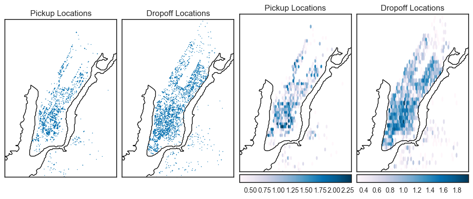

# Delivery Service New York City Market Analysis
The delivery service's newest market has just opened in New York City. I currently have the data for the month of October 2014. This analysis will go through details of how the market is performing so that we can gain a better understanding of how to improve our service in New York City. 

This analysis will specifically focus on:
* Number of deliveries
* Most popular places
* Average delivery times
* Most popular pickup and dropoff locations
------------

## Importing and Cleaning the Data
Before I start my analysis, I would like to preview and clean up the data. I will also use this section to investigate any data integrity issues.

First I will import the data and view the first five rows to understand what kind of data we're working with.


```python
#Importing relevant libraries
%matplotlib inline
import pandas as pd
import numpy as np
import matplotlib.pyplot as plt
import seaborn as sns
from matplotlib.gridspec import GridSpec
from mpl_toolkits.basemap import Basemap

#Setting plot backgrounds to white
sns.set(style="white")

#Reading CSV file
df = pd.read_csv('delivery_info.csv')

#Previewing the data
df.head(n=5)
```

    //anaconda/lib/python2.7/site-packages/matplotlib/font_manager.py:273: UserWarning: Matplotlib is building the font cache using fc-list. This may take a moment.
      warnings.warn('Matplotlib is building the font cache using fc-list. This may take a moment.')


<div>
<table border="1" class="dataframe">
  <thead>
    <tr style="text-align: right;">
      <th></th>
      <th>delivery_id</th>
      <th>customer_id</th>
      <th>courier_id</th>
      <th>vehicle_type</th>
      <th>pickup_place</th>
      <th>place_category</th>
      <th>item_name</th>
      <th>item_quantity</th>
      <th>item_category_name</th>
      <th>how_long_it_took_to_order</th>
      <th>pickup_lat</th>
      <th>pickup_lon</th>
      <th>dropoff_lat</th>
      <th>dropoff_lon</th>
      <th>when_the_delivery_started</th>
      <th>when_the_courier_arrived_at_pickup</th>
      <th>when_the_courier_left_pickup</th>
      <th>when_the_courier_arrived_at_dropoff</th>
    </tr>
  </thead>
  <tbody>
    <tr>
      <th>0</th>
      <td>1457973</td>
      <td>327168</td>
      <td>162381</td>
      <td>van</td>
      <td>Melt Shop</td>
      <td>American</td>
      <td>Lemonade</td>
      <td>1.0</td>
      <td>Beverages</td>
      <td>00:19:58.582052</td>
      <td>40.744607</td>
      <td>-73.990742</td>
      <td>40.752073</td>
      <td>-73.985370</td>
      <td>2014-10-26 13:51:59.898924</td>
      <td>NaN</td>
      <td>NaN</td>
      <td>2014-10-26 14:52:06.313088</td>
    </tr>
    <tr>
      <th>1</th>
      <td>1377056</td>
      <td>64452</td>
      <td>104533</td>
      <td>bicycle</td>
      <td>Prince Street Pizza</td>
      <td>Pizza</td>
      <td>Neapolitan Rice Balls</td>
      <td>3.0</td>
      <td>Munchables</td>
      <td>00:25:09.107093</td>
      <td>40.723080</td>
      <td>-73.994615</td>
      <td>40.719722</td>
      <td>-73.991858</td>
      <td>2014-10-16 21:58:58.65491</td>
      <td>2014-10-16 22:26:02.120931</td>
      <td>2014-10-16 22:48:23.091253</td>
      <td>2014-10-16 22:59:22.948873</td>
    </tr>
    <tr>
      <th>2</th>
      <td>1476547</td>
      <td>83095</td>
      <td>132725</td>
      <td>bicycle</td>
      <td>Bareburger</td>
      <td>Burger</td>
      <td>Bare Sodas</td>
      <td>1.0</td>
      <td>Drinks</td>
      <td>00:06:44.541717</td>
      <td>40.728478</td>
      <td>-73.998392</td>
      <td>40.728606</td>
      <td>-73.995143</td>
      <td>2014-10-28 21:39:52.654394</td>
      <td>2014-10-28 21:37:18.793405</td>
      <td>2014-10-28 21:59:09.98481</td>
      <td>2014-10-28 22:04:40.634962</td>
    </tr>
    <tr>
      <th>3</th>
      <td>1485494</td>
      <td>271149</td>
      <td>157175</td>
      <td>bicycle</td>
      <td>Juice Press</td>
      <td>Juice Bar</td>
      <td>OMG! My Favorite Juice!</td>
      <td>1.0</td>
      <td>Cold Pressed Juices</td>
      <td>NaN</td>
      <td>40.738868</td>
      <td>-74.002747</td>
      <td>40.751257</td>
      <td>-74.005634</td>
      <td>2014-10-30 10:54:11.531894</td>
      <td>2014-10-30 11:04:17.759577</td>
      <td>2014-10-30 11:16:37.895816</td>
      <td>2014-10-30 11:32:38.090061</td>
    </tr>
    <tr>
      <th>4</th>
      <td>1327707</td>
      <td>122609</td>
      <td>118095</td>
      <td>bicycle</td>
      <td>Blue Ribbon Sushi</td>
      <td>Japanese</td>
      <td>Spicy Tuna &amp; Tempura Flakes</td>
      <td>2.0</td>
      <td>Maki (Special Rolls)</td>
      <td>00:03:45.035418</td>
      <td>40.726110</td>
      <td>-74.002492</td>
      <td>40.709323</td>
      <td>-74.015867</td>
      <td>2014-10-10 00:07:18.450505</td>
      <td>2014-10-10 00:14:42.702223</td>
      <td>2014-10-10 00:25:19.400294</td>
      <td>2014-10-10 00:48:27.150595</td>
    </tr>
  </tbody>
</table>
</div>


```python
#Finding rows and columns
print df.shape
```

    (5983, 18)


This dataset currently has 18 attributes and 5983 entries.

What type of data are we working with?


```python
#Viewing information on data
df.info()
```

    <class 'pandas.core.frame.DataFrame'>
    RangeIndex: 5983 entries, 0 to 5982
    Data columns (total 18 columns):
    delivery_id                            5983 non-null int64
    customer_id                            5983 non-null int64
    courier_id                             5983 non-null int64
    vehicle_type                           5983 non-null object
    pickup_place                           5983 non-null object
    place_category                         5100 non-null object
    item_name                              4753 non-null object
    item_quantity                          4753 non-null float64
    item_category_name                     4753 non-null object
    how_long_it_took_to_order              3038 non-null object
    pickup_lat                             5983 non-null float64
    pickup_lon                             5983 non-null float64
    dropoff_lat                            5983 non-null float64
    dropoff_lon                            5983 non-null float64
    when_the_delivery_started              5983 non-null object
    when_the_courier_arrived_at_pickup     5433 non-null object
    when_the_courier_left_pickup           5433 non-null object
    when_the_courier_arrived_at_dropoff    5983 non-null object
    dtypes: float64(5), int64(3), object(10)
    memory usage: 841.4+ KB


It looks like we may have some missing values so I want to see exactly how many values we're missing.


```python
#Checking for null values
print df.isnull().sum()
```

    delivery_id                               0
    customer_id                               0
    courier_id                                0
    vehicle_type                              0
    pickup_place                              0
    place_category                          883
    item_name                              1230
    item_quantity                          1230
    item_category_name                     1230
    how_long_it_took_to_order              2945
    pickup_lat                                0
    pickup_lon                                0
    dropoff_lat                               0
    dropoff_lon                               0
    when_the_delivery_started                 0
    when_the_courier_arrived_at_pickup      550
    when_the_courier_left_pickup            550
    when_the_courier_arrived_at_dropoff       0
    dtype: int64


We are missing a lot of information on item details as well as how long it took to order. I will need to take this into consideration when completing my analysis. I will not remove these null values since it will remove too much information on other metrics for my analysis.

I also want to check to make sure we don't have any duplicate rows.


```python
#Searching for duplicate rows
num_duplicates = 0
for i in df.duplicated():
    if i == True:
        num_duplicates += 1
print 'Number of Duplicates:',num_duplicates
```

    Number of Duplicates: 16


It seems we have 16 duplicate rows in the dataset. Because these duplicates will overstate our numbers, I'm going to remove these so that they don't skew my analysis.


```python
#Dropping duplicates
df.drop_duplicates(inplace = True)
```

Now I want to convert the delivery timestamps to datetime formats so that I can better analyze the amount of time it took to deliver. I'll also add another column to the dataframe that will calculate the total delivery time.


```python
#Converting delivery timestamps to datetime formats
df['when_the_delivery_started'] = pd.to_datetime(df['when_the_delivery_started'])
df['when_the_courier_arrived_at_pickup'] = pd.to_datetime(df['when_the_courier_arrived_at_pickup'])
df['when_the_courier_left_pickup'] = pd.to_datetime(df['when_the_courier_left_pickup'])
df['when_the_courier_arrived_at_dropoff'] = pd.to_datetime(df['when_the_courier_arrived_at_dropoff'])

#Adding another column to calculate total delivery time
df['delivery_time'] = df['when_the_courier_arrived_at_dropoff'] - df['when_the_delivery_started']
```

Next I'll create separate columns for day and hour so that I can better analyze our deliveries over time. I also want to create a column for the day of the week so that I can analyze the difference between weekday and weekend deliveries.


```python
#Adding separate columns for day, hour, day of week
df['delivery_day'] = df['when_the_delivery_started'].dt.day
df['delivery_hour'] = df['when_the_delivery_started'].dt.hour
df['day_of_week'] = df['when_the_delivery_started'].dt.dayofweek

#Defining function to label days as a weekday or weekend
def week(x):
    if x['day_of_week'] in range(5):
        return 'Weekday'
    else:
        return 'Weekend'

#Adding a separate column for the categorization of weekday or weekend
df['weekday_weekend'] = df.apply(week,axis = 1)
```

-------------------
## Analysis

#### Number of Deliveries
First I want to look at how many deliveries we've completed over time.


```python
#Creating series of deliveries by day
deliveries_by_day = df.groupby(['delivery_day']).count()['delivery_id']

#Plotting deliveries by day
fig = plt.figure(figsize=(10,5))
ax1 = fig.add_subplot(111)
ax1.plot(deliveries_by_day.index, deliveries_by_day.values, color = '#74a9cf')

#Calculating trendline
z = np.polyfit(deliveries_by_day.index, deliveries_by_day.values, 1)
p = np.poly1d(z)

#Plotting trendline
ax1 = fig.add_subplot(111)
ax1.plot(deliveries_by_day.index,p(deliveries_by_day.index),'r-', color = '#bdc9e1', linestyle = 'dashed')

#Highlighting weekends
plt.axvspan(3.5, 5.5, facecolor = 'k', alpha = 0.05)
plt.axvspan(10.5, 12.5, facecolor = 'k', alpha = 0.05)
plt.axvspan(17.5, 19.5, facecolor = 'k', alpha = 0.05)
plt.axvspan(24.5, 26.5, facecolor = 'k', alpha = 0.05)

#Modifying chart
plt.xticks(deliveries_by_day.index)
ax1.set_ylim(ymin = 100)
ax1.set_xlim(xmin = 1)
plt.title('Number of Deliveries for October 2014')
plt.ylabel('Number of Deliveries')
plt.xlabel('Day')

plt.show()
```


Great! From the chart above we can see that deliveries have been trending up through the month.
Where we see peaks are the Sundays of each week (I have highlighted the weekends with grey bars). 

It's interesting to see that deliveries generally climb Monday through Friday but then take a slight dip for Saturday before reaching a peak on Sundays. I wonder if it's because customers are usually too busy out on Saturdays to order deliveries. Deliveries may peak on Sundays because customers tend to leave their errands for Sunday or are more likely to order-in on this rest day.

Next I want to analyze which times of the day receive the most orders. I will split this analysis into weekdays and weekends since customers will have different schedules depending on the day of the week.


```python
#Creating series of deliveries by hour for weekdays and weekends
weekday_hourly_deliveries = df[df['weekday_weekend'] == 'Weekday'].groupby(['delivery_hour']).count()['delivery_id']
weekend_hourly_deliveries = df[df['weekday_weekend'] == 'Weekend'].groupby(['delivery_hour']).count()['delivery_id']

#Creating a grid to arrange the plots

the_grid = GridSpec(2, 1)
the_grid.update(left=0.05, right=1, hspace=0.5)

#Plotting deliveries by hour for weekdays
fig = plt.figure(figsize=(9,5))
ax1 = fig.add_subplot(the_grid[0])
ax1.plot(weekday_hourly_deliveries.index, weekday_hourly_deliveries.values, color = '#74a9cf')
plt.xticks(range(24))
ax1.set_xlim(xmax = 23)
plt.title('Weekday Deliveries by the Hour')
plt.ylabel('Number of Deliveries')
plt.xlabel('Hour')

#Plotting deliveries by hour for weekends
ax2 = fig.add_subplot(the_grid[1])
ax2.plot(weekend_hourly_deliveries.index, weekend_hourly_deliveries.values, color = '#74a9cf')
plt.xticks(range(24))
ax2.set_xlim(xmax = 23)
plt.title('Weekend Deliveries by the Hour')
plt.ylabel('Number of Deliveries')
plt.xlabel('Hour')

plt.show()
```


It seems that for both weekdays and weekends we see our first peak around lunch time, and the largest number of deliveries around dinner. However for the weekday, deliveries dip after lunch, while on the weekend, deliveries remain constant and build up to dinner earlier than they do during the weekday. We want to make sure we have enough couriers available to complete these deliveries during these times.

#### Most Popular Places

Because we see deliveries peak around lunch and dinner, we may assume that the most popular deliveries are meals. I want to see what the top 10 place categories are.


```python
#Creating series of top 10 place categories delivered
top_place_categories = df.groupby(['place_category']).count()['delivery_id'].sort_values(ascending = False)[:10]

#Plotting top 10 place categories delivered
plt.figure(figsize=(9,5))
sns.barplot(y = top_place_categories.index, x = top_place_categories.values, palette = 'PuBu_r')
plt.title('Top 10 Place Categories')
plt.xlabel('Number of Deliveries')
plt.ylabel('Place Category')

plt.show()
```


The number one place category our customers like to order from are Italian restaurants. Is this because we offer more Italian options than any other type of restaurant? This is something I would like more information on in order to investigate more. If that is not the case, then we may want to look to add more Italian restaurant options to increase our deliveries.

We also need to keep in mind that this dataset is missing 883 values in the place_category column. Thus the actual top 10 places may not be the same as what is depicted above.

I also want to see how these place categories have performed over the month.


```python
#Creating pivot table of most popular place categories by day
place_category_table = pd.pivot_table(df[df['place_category'].isin(top_place_categories.index)],
                                      values = ['delivery_id'], index = ['place_category'], 
                                      columns = ['delivery_day'], aggfunc = 'count')

#Plotting heatmap of most popular place categories by day
plt.figure(figsize=(11,3))
sns.heatmap(place_category_table['delivery_id'], annot = True, annot_kws = {'size': 7}, fmt = 'g', cmap = 'PuBu')
plt.title('Number of Deliveries by Day and Place Category')
plt.xlabel('Day')
plt.ylabel('Place Category')

plt.show()
```


Next we'll look at our most popular places.


```python
#Creating series of top 10 places delivered
top_places = df.groupby(['pickup_place']).count()['delivery_id'].sort_values(ascending = False)[:10]

#Plotting top 10 places delivered
plt.figure(figsize=(9,5))
sns.barplot(y = top_places.index, x = top_places.values, palette = 'PuBu_r')
plt.title('Top 10 Places')
plt.xlabel('Number of Deliveries')
plt.ylabel('Place')

plt.show()
```


Shake Shack is doing really well. We want to make sure we maintain this relationship and continue to build out our options with Shake Shack.

Again, we'll look at how these places have performed over the month.


```python
#Creating pivot table of most popular place categories by day
place_table = pd.pivot_table(df[df['pickup_place'].isin(top_places.index)], 
                             values = ['delivery_id'], index = ['pickup_place'], 
                             columns = ['delivery_day'], aggfunc = 'count')

#Plotting heatmap of most popular place categories by day
plt.figure(figsize=(11,3))
sns.heatmap(place_table['delivery_id'], annot = True, annot_kws = {'size': 7}, fmt = 'g', cmap = 'PuBu')
plt.title('Number of Deliveries by Day and Place')
plt.xlabel('Day')
plt.ylabel('Place')

plt.show()
```


#### Average Delivery Times
Next I want to take a look at what our average delivery times are.


```python
#Converting delivery times from timedelta to float
df['delivery_time'] = df['delivery_time']/pd.Timedelta(minutes=1)
```


```python
#Descriptive statistics of delivery times
print 'General Statistics of Delivery Times'
print df['delivery_time'].describe()

#Creating a grid to arrange the plots
the_grid = GridSpec(2, 1)
the_grid.update(left=0.05, right=1, hspace=0.2)

#Creating series of delivery times
delivery_times = df['delivery_time']

#Plotting histogram of average delivery times 
fig = plt.figure(figsize=(9,5))
ax1 = fig.add_subplot(the_grid[0])
ax1.hist(delivery_times,75,color = '#74a9cf')
plt.title('Distribution of Delivery Times')
plt.ylabel('Number of Deliveries')

#Plotting boxplot of delivery times with outliers
ax2 = fig.add_subplot(the_grid[1])
sns.boxplot(df['delivery_time'])
plt.xlabel('Length of Delivery (in mins)')

plt.show()
```

    General Statistics of Delivery Times
    count    5967.000000
    mean       46.091013
    std        20.243492
    min         3.047181
    25%        32.666752
    50%        42.674769
    75%        55.148273
    max       340.308810
    Name: delivery_time, dtype: float64


Our average delivery time for the month is around 46 minutes. It looks like we have some deliveries that were ridiculously long - the longest being 340 minutes. I want to identify these outliers so that we can investigate them further.


```python
#Calculating outliers and display list. Remove outliers from further analysis
df['delivery_outlier'] = abs(df['delivery_time'] - df['delivery_time'].mean()) > 1.96*df['delivery_time'].std()
print 'Number of Delivery Time Outliers'
print df[df['delivery_outlier'] == True].count()['delivery_outlier']
```

    Number of Delivery Time Outliers
    255


I have calculated 225 outliers for this dataset. I will to remove these outliers from my analysis so that they do not skew the results.

I am particularily interested in the delivery time that took 340 minutes. I have pulled it out so that we can investigate the problem further and take action to prevent something similar from happening in the future.


```python
df[df['delivery_time'] == 340.308810]
```


<div>
<table border="1" class="dataframe">
  <thead>
    <tr style="text-align: right;">
      <th></th>
      <th>delivery_id</th>
      <th>customer_id</th>
      <th>courier_id</th>
      <th>vehicle_type</th>
      <th>pickup_place</th>
      <th>place_category</th>
      <th>item_name</th>
      <th>item_quantity</th>
      <th>item_category_name</th>
      <th>how_long_it_took_to_order</th>
      <th>...</th>
      <th>when_the_delivery_started</th>
      <th>when_the_courier_arrived_at_pickup</th>
      <th>when_the_courier_left_pickup</th>
      <th>when_the_courier_arrived_at_dropoff</th>
      <th>delivery_time</th>
      <th>delivery_day</th>
      <th>delivery_hour</th>
      <th>day_of_week</th>
      <th>weekday_weekend</th>
      <th>delivery_outlier</th>
    </tr>
  </thead>
  <tbody>
    <tr>
      <th>1606</th>
      <td>1381673</td>
      <td>377260</td>
      <td>166715</td>
      <td>bicycle</td>
      <td>Blue Ribbon Fried Chicken</td>
      <td>American</td>
      <td>The Blue Ribbon</td>
      <td>1.0</td>
      <td>Sandwiches</td>
      <td>NaN</td>
      <td>...</td>
      <td>2014-10-17 17:36:36.655417</td>
      <td>2014-10-17 17:39:57.071973</td>
      <td>2014-10-17 22:07:54.314590</td>
      <td>2014-10-17 23:16:55.184017</td>
      <td>340.30881</td>
      <td>17</td>
      <td>17</td>
      <td>4</td>
      <td>Weekday</td>
      <td>True</td>
    </tr>
  </tbody>
</table>
<p>1 rows × 24 columns</p>
</div>


```python
#Finding outlier range
df[df['delivery_outlier'] == True][df['delivery_time'] > 42].min()['delivery_time']
```

    /anaconda/lib/python2.7/site-packages/ipykernel/__main__.py:2: UserWarning: Boolean Series key will be reindexed to match DataFrame index.
      from ipykernel import kernelapp as app
    //anaconda/lib/python2.7/site-packages/numpy/core/_methods.py:29: RuntimeWarning: tp_compare didn't return -1 or -2 for exception
      return umr_minimum(a, axis, None, out, keepdims)


    85.774107549999997


We may also want to look into any delivery that took over 85 minutes to see if there was an issue and how we may improve our delivery times.

Next I will analyze how our average delivery times have changed over the course of October.


```python
#Creating a series of average delivery times through the month
avg_delivery_times_by_day = df[df['delivery_outlier'] == False].groupby(['delivery_day']).mean()['delivery_time']

#Creating a grid to arrange the plots
the_grid = GridSpec(2, 1)
the_grid.update(left=0.05, right=1, hspace=0.5)

#Plotting average delivery times through the month
fig = plt.figure(figsize=(9,5))
ax1 = fig.add_subplot(the_grid[0])
ax1.plot(avg_delivery_times_by_day.index, avg_delivery_times_by_day.values, color = '#74a9cf')

#Calculating trendline
z = np.polyfit(avg_delivery_times_by_day.index, avg_delivery_times_by_day.values, 1)
p = np.poly1d(z)

#Plotting trendline
ax1 = fig.add_subplot(the_grid[0])
ax1.plot(avg_delivery_times_by_day.index,p(avg_delivery_times_by_day.index),'r-', 
         color = '#bdc9e1', linestyle = 'dashed')

#Modifying the chart
plt.xticks(avg_delivery_times_by_day.index)
ax1.set_xlim(xmin = 1)
plt.title('Average Delivery Times for October 2014')
plt.ylabel('Average Delivery Time')
plt.xlabel('Day')

#Highlighting weekends
plt.axvspan(3.5, 5.5, facecolor = 'k', alpha = 0.05)
plt.axvspan(10.5, 12.5, facecolor = 'k', alpha = 0.05)
plt.axvspan(17.5, 19.5, facecolor = 'k', alpha = 0.05)
plt.axvspan(24.5, 26.5, facecolor = 'k', alpha = 0.05)

#Plotting deliveries by day
ax2 = fig.add_subplot(the_grid[1])
ax2.plot(deliveries_by_day.index, deliveries_by_day.values, color = '#74a9cf')
plt.xticks(deliveries_by_day.index)
ax2.set_xlim(xmin = 1)
plt.title('Number of Deliveries for October 2014')
plt.ylabel('Number of Deliveries')
plt.xlabel('Day')

#Highlighting weekends
plt.axvspan(3.5, 5.5, facecolor = 'k', alpha = 0.05)
plt.axvspan(10.5, 12.5, facecolor = 'k', alpha = 0.05)
plt.axvspan(17.5, 19.5, facecolor = 'k', alpha = 0.05)
plt.axvspan(24.5, 26.5, facecolor = 'k', alpha = 0.05)

plt.show()
```


```python
print 'Average Delivery Time Line Equation'
print 'y = %.6fx + (%.6f)'%(z[0],z[1])
```

    Average Delivery Time Line Equation
    y = -0.021731x + (43.608548)


What is great is that our overall average delivery times have stayed consistent through the month of October, even with our increasing number of deliveries. The average delivery time has even decreased slightly (difficult to tell on the chart, but it is a slope of -0.02).

However, as the number of deliveries increases through the week, our average delivery times increase as well. We may not have enough couriers to react to the increased delivery needs. We will want to look into hiring more couriers, or providing a larger incentive, as the number of deliveries increases through the week so that we can decrease our average delivery times.

Let's take a closer look at how average delivery times differ on the weekdays and weekends.


```python
#Descriptive statistics of Delivery Times
print 'General Statistics of Delivery Times for Weekdays'
print df[df['weekday_weekend'] == 'Weekday'][df['delivery_outlier'] == False]['delivery_time'].describe()
print ""
print 'General Statistics of Delivery Times for Weekends'
print df[df['weekday_weekend'] == 'Weekend'][df['delivery_outlier'] == False]['delivery_time'].describe()
```

    General Statistics of Delivery Times for Weekdays
    count    3872.000000
    mean       42.632554
    std        15.064014
    min         6.621388
    25%        31.614946
    50%        41.100149
    75%        52.293959
    max        85.702000
    Name: delivery_time, dtype: float64
    
    General Statistics of Delivery Times for Weekends
    count    1840.000000
    mean       45.236165
    std        15.219778
    min         8.885226
    25%        33.861569
    50%        43.634689
    75%        55.628988
    max        85.725073
    Name: delivery_time, dtype: float64


    /anaconda/lib/python2.7/site-packages/ipykernel/__main__.py:3: UserWarning: Boolean Series key will be reindexed to match DataFrame index.
      app.launch_new_instance()
    /anaconda/lib/python2.7/site-packages/ipykernel/__main__.py:6: UserWarning: Boolean Series key will be reindexed to match DataFrame index.


The average delivery time for the weekend is 45.2 minutes, which is slightly higher than the average delivery time for the weekday at 42.6 minutes


```python
#Creating series of average delivery times by hour for weekdays and weekends
avg_weekday_delivery_times = df[df['weekday_weekend'] == 'Weekday'].groupby(['delivery_hour']).mean()['delivery_time']
avg_weekend_delivery_times = df[df['weekday_weekend'] == 'Weekend'].groupby(['delivery_hour']).mean()['delivery_time']

#Plotting average delivery times by hour for weekdays and weekends
fig = plt.figure(figsize=(10,5))
ax1 = fig.add_subplot(111)
ax1.plot(avg_weekday_delivery_times.index, avg_weekday_delivery_times.values, color = '#0570b0', label = 'Weekday')
ax1.plot(avg_weekend_delivery_times.index, avg_weekend_delivery_times.values, color = '#bdc9e1', label = 'Weekend')

#Modifying the chart
plt.xticks(range(24))
ax1.set_xlim(xmax = 23)
ax1.set_ylim(ymin = 30, ymax = 75)
plt.title('Average Delivery Times for Weekdays and Weekends')
plt.ylabel('Average Delivery Time')
plt.xlabel('Hour')
ax1.legend()

plt.show()
```


Where we see a peak in average delivery times on the weekend we see a drop on the weekdays. More people are up later on the weekends, which probably results in more orders. Again we may not have enough couriers at these late night/early morning hours to respond to the number of orders being placed, which is resulting in the longer delivery times.

#### Most Popular Pickup and Dropoff Locations
Finally, I will plot out the locations of our deliveries to see where in NYC we have the most activity.


```python
#Creating a grid to arrange the plots
the_grid = GridSpec(1,4)
the_grid.update(left=0.05, right=1, wspace=0.05)

#Plotting map of most popular pickup locations
fig = plt.figure(figsize=(10,10))
m1 = fig.add_subplot(the_grid[0])
m1 = Basemap(projection = 'merc', resolution = 'f', lat_0 = 40.74, lon_0 = -73.97, 
             llcrnrlon = -74.05, llcrnrlat = 40.68, urcrnrlon = -73.91, urcrnrlat = 40.83)
m1.drawcoastlines()
pickup_lons = df['pickup_lon'].tolist()
pickup_lats = df['pickup_lat'].tolist()
x,y = m1(pickup_lons, pickup_lats)
m1.plot(x,y,'bo',markersize = 1, color = '#0570b0')
plt.title('Pickup Locations')

#Plot map of most popular dropoff locations
m2 = fig.add_subplot(the_grid[1])
m2 = Basemap(projection = 'merc', resolution = 'f', lat_0 = 40.74, lon_0 = -73.97, 
             llcrnrlon = -74.05, llcrnrlat = 40.68, urcrnrlon = -73.91, urcrnrlat = 40.83)
m2.drawcoastlines()
dropoff_lons = df['dropoff_lon'].tolist()
dropoff_lats = df['dropoff_lat'].tolist()
x,y = m2(dropoff_lons, dropoff_lats)
m2.plot(x,y,'bo',markersize = 1, color = '#0570b0')
plt.title('Dropoff Locations')

#Plotting map of most popular pickup locations
m3 = fig.add_subplot(the_grid[2])
m3 = Basemap(projection = 'merc', resolution = 'f', lat_0 = 40.74, lon_0 = -73.97, 
             llcrnrlon = -74.05, llcrnrlat = 40.68, urcrnrlon = -73.91, urcrnrlat = 40.83)
m3.drawcoastlines()
pickup_lons = df['pickup_lon'].tolist()
pickup_lats = df['pickup_lat'].tolist()
x,y = m3(pickup_lons, pickup_lats)
m3.hexbin(np.array(x), np.array(y), gridsize = 50, bins = 'log', mincnt = 1, cmap = 'PuBu')
m3.colorbar(location='bottom')
plt.title('Pickup Locations')

#Plot map of most popular dropoff locations
m4 = fig.add_subplot(the_grid[3])
m4 = Basemap(projection = 'merc', resolution = 'f', lat_0 = 40.74, lon_0 = -73.97, 
             llcrnrlon = -74.05, llcrnrlat = 40.68, urcrnrlon = -73.91, urcrnrlat = 40.83)
m4.drawcoastlines()
dropoff_lons = df['dropoff_lon'].tolist()
dropoff_lats = df['dropoff_lat'].tolist()
x,y = m4(dropoff_lons, dropoff_lats)
m4.hexbin(np.array(x), np.array(y), gridsize = 50, bins = 'log', mincnt = 1, cmap = 'PuBu')
m4.colorbar(location='bottom')
plt.title('Dropoff Locations')

plt.show()
```





Our most popular pickup and dropoff locations are around Lower Manhattan (as indicated by the darker spots in the heatmaps). However a large number of our customers do live around the Upper East Side. We may want to look into adding more options around the Upper East Side and Upper West Side.

---------------

## Summary

### Data Integrity Issues
When cleaning the data, I found two main issues:  

**Missing values:**  
We are missing a lot of values for attributes such as place_category, item_quantity, item_category_name, and how_long_it_took_to_order. Without the proper data for these fields, it is difficult to properly assess how we are performing. I am particularly interested in how long it took to order because I want to understand how long customers are spending in our app. It is taking them too long? Is our app difficult to use?  

**Duplicate rows:**  
I found 16 duplicate entries within the dataset. If we have multiple entries of the same order, it will overstate our deliveries and thus skew the analysis.

### Analysis
**Number of Deliveries:**  
Overall the number of deliveries we have completed has gone up through the month of October. As each week progresses, we see the number of deliveries increase, take a drop on Saturday, and then peak on Sundays.  

On both weekdays and weekends, deliveries first peak at around lunch time. However on the weekdays, deliveries slow down again until dinner while on the weekends, deliveries remain constant until they peak around dinner. On both weekdays and weekends we see the most number of orders occur around dinner. We want to make sure we have enough couriers to respond to these orders during peak lunch and dinner times.

**Most Popular Places:**  
Our most popular place category is Italian, followed by burger places, and Japanese. We want to make sure we build out our options in these categories so that customers continue to order through our app. To further investigate our most popular place categories, I would like to know how many of each category we offer so that I can better understand if Italian is our top category just because we offer the most Italian options proportionate to other categories.  

Although Italian is our most popular place category, our most popular place is Shake Shack. Shake Shack has continued to perform the strongest through the month so we want to make sure we maintain this relationship.

**Average Delivery Times:**  
Overall, delivery times have stayed consistent through the month, despite having an increasing number of deliveries. Our average delivery time for the month has been 46 minutes. However I have found a number of deliveries that took much longer and should be investigated further to better understand how we may improve our operations.  

As the number of deliveries increases through the week, our average delivery time increases as well. This could be because we do not have enough couriers during these peak times to respond quickly enough to the orders. We may want to look into either hiring more couriers during peak times or provide a better incentive to have our couriers work during these times.

**Most Popular Pickup and Dropoff Locations:**  
We see the most activity around Lower Manhattan, which may be because we have more options around this area. However a large number of our dropoff locations are in the Upper East Side. 


```python

```
